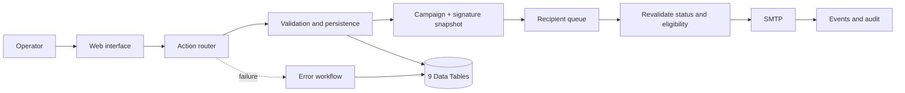

# Mala Direta — n8n Email Operations Automation

[Português](README.md)

I built Mala Direta to replace a campaign process based on spreadsheets, manual address copying, scattered signature files and limited visibility into deliveries, failures and cancellations. The team can now create, review, test, schedule and track campaigns from a browser without opening the n8n editor.

## Overview

| Area | Current state |
|---|---|
| **Internal use** | Six campaigns executed over a current base of 1,020 contacts. |
| **Campaign scale** | One campaign included 900+ recipients; changed or invalid addresses were identified for review. |
| **Public architecture** | Two workflows; the main flow has 158 nodes, 72 Data Table nodes, 49 Code nodes and nine domain Data Tables. |
| **Reliability** | Recipient-level state, deduplication, suppression, retries, a separate error workflow and auditable events. |
| **Operational control** | Cancellation is revalidated inside the loop before every recipient. Messages already accepted by SMTP cannot be recalled. |
| **Privacy** | Inactive exports, fictional data, no credentials and automated checks for the public version. |

> The n8n environment hosting this and other automations has surpassed **10,000 production executions**. That volume belongs to the complete environment, not only to Mala Direta.

## How it works

n8n handles business rules, persistence, queues, SMTP, auditing and failure recovery. The browser interface gives non-technical operators a simple way to use the process.



## Operational safeguards

| Situation | Automation response |
|---|---|
| The operator does not know n8n | The workflow webhooks serve the web interface. |
| A campaign is cancelled while the queue is running | Status and eligibility are checked again before every recipient. |
| The provider is slow or a batch fails | Per-recipient state, controlled retries and a separate technical-error workflow. |
| A signature changes | A versioned library and a campaign-level snapshot. |
| A contact must not return to the queue | Suppression and deduplication by campaign + recipient. |
| Queue activity changes dashboard totals | Stable aggregate queries instead of concurrent recipient pagination. |

## Published technical structure

| Indicator | Value |
|---|---:|
| Public workflows | 2 |
| Nodes in the main workflow | 158 |
| Data Table nodes | 72 |
| Code nodes | 49 |
| Public webhooks | 3 |
| Schedule Triggers | 2 |
| Domain Data Tables | 9 |
| Real secrets or campaigns in the repository | 0 |

[`scripts/validate-public-workflows.js`](scripts/validate-public-workflows.js) checks the minimum topology, routes, Code node compilation and the absence of internal references or credentials.

## Interface

| Overview | Message and preview |
|---|---|
|  |  |

| Recipients | Campaign operations |
|---|---|
|  |  |

## Engineering decisions

- I separated campaigns and recipients to track progress, retries, blocking and individual history;
- I used PostgreSQL-backed Data Tables to avoid concurrent files;
- I placed cancellation checks inside the loop instead of only at campaign start;
- I isolated technical failures in a separate error workflow;
- I kept credentials in the n8n vault;
- I kept the frontend inside the workflow to reduce deployment overhead for the local operation.

## Run and validate

```powershell
npm ci
npm test
```

The two public workflows remain inactive by design. A study installation requires nine Data Tables and a user-owned SMTP credential in the n8n vault. See [`docs/DEPLOYMENT.md`](docs/DEPLOYMENT.md).

## Current limits

- the public version does not claim an SLA or formal delivery audit;
- bounce handling, reputation, unsubscribe, SPF, DKIM and DMARC must be monitored as volume grows;
- multiple workers would require additional concurrency and rate-limit controls;
- outside a trusted network, the interface requires authentication and TLS;
- the automation must not be used for unsolicited email.

> This repository is a demonstrative public slice of the internal solution. Names, domains, addresses, campaigns, credentials and internal IDs were removed or replaced.

## Author

**Maycon Ferreira** — discovery, automation architecture, workflows, integrations, operational UX, deployment, training, validation and support.
