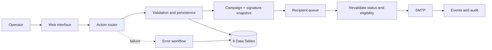

# Mala Direta — n8n Email Operations Automation

[Português](README.md)

Internal email-campaign product built for non-technical operators, with a browser interface, recipient-level queues, revalidated cancellation, SMTP, history and auditing.

## Recruiter overview

| Dimension | Current evidence |
|---|---|
| **Real use** | Six campaigns executed over a current base of 1,020 contacts. |
| **Campaign scale** | One campaign included 900+ recipients; returned messages caused by changed or invalid addresses were identified for review. |
| **Public architecture** | Two workflows; the main flow has 158 nodes, 72 Data Table nodes, 49 Code nodes and nine domain Data Tables. |
| **Reliability** | Recipient-level state, deduplication, suppression, retries, a separate error workflow and auditable events. |
| **Operational control** | Cancellation is revalidated inside the loop before every recipient. Messages already accepted by SMTP cannot be recalled. |
| **Public safety** | Inactive exports, fictional data, no credentials and automated privacy validation. |

> The internal n8n environment hosting this and other automations has surpassed **10,000 production executions**. That number belongs to the complete environment and is not attributed exclusively to Mala Direta.

## Problem solved

The previous process relied on spreadsheets, manual address copying, scattered signature files and limited visibility into deliveries, failures and cancellations. I turned it into an internal browser-based product where the team creates a campaign, reviews recipients, selects a signature, tests, schedules and tracks results without opening the n8n editor.

n8n owns business rules, persistence, queues, SMTP, auditing and failure recovery.

> This repository is a demonstrative public slice of the operating solution. Names, domains, addresses, campaigns, credentials and internal IDs were removed or replaced.

## Operational protections

| Situation | Automation response |
|---|---|
| Operator does not know n8n | Web interface served by the workflow webhooks. |
| Campaign is cancelled during queue processing | Status and eligibility are revalidated before every recipient. |
| Provider is slow or a batch fails | Per-recipient state, controlled retry and a separate technical-error workflow. |
| Signature changes | Versioned library and campaign-level snapshot. |
| Contact must not return to the queue | Suppression and deduplication by campaign + recipient. |
| Queue changes dashboard totals | Stable aggregate queries instead of concurrent pagination over recipients. |

## Public export evidence

| Indicator | Value |
|---|---:|
| Public workflows | 2 |
| Nodes in the main workflow | 158 |
| Data Table nodes | 72 |
| Code nodes | 49 |
| Public webhooks | 3 |
| Schedule Triggers | 2 |
| Domain Data Tables | 9 |
| Real secrets or campaigns in the repository | 0 |

[`scripts/validate-public-workflows.js`](scripts/validate-public-workflows.js) enforces the minimum topology, checks routes, compiles Code nodes and blocks internal references or credentials.

## Interface and flow

| Overview | Message and preview |
|---|---|
|  |  |

| Recipients | Campaign operations |
|---|---|
|  |  |



## Engineering decisions

- campaign and recipient are separate entities for progress, retries, blocking and individual history;
- PostgreSQL-backed Data Tables avoid concurrent files;
- cancellation is checked inside the loop, not only when the campaign starts;
- technical failures are isolated from business flow;
- credentials remain in the n8n vault;
- the frontend lives in the workflow to reduce deployment surface for the local operation.

## Local validation

```powershell
npm ci
npm test
```

The two public workflows are inactive by design. A study installation requires nine Data Tables and a user-owned SMTP credential in the n8n vault. See [`docs/DEPLOYMENT.md`](docs/DEPLOYMENT.md).

## Limits

- no SLA or formal delivery audit is claimed;
- bounce handling, reputation, unsubscribe, SPF, DKIM and DMARC must be monitored as volume grows;
- multiple workers would require additional concurrency and rate-limit controls;
- the interface must be protected by authentication and TLS outside a trusted network;
- the automation must not be used for unsolicited email.

## Author

**Maycon Ferreira** — discovery, automation architecture, workflows, integrations, operational UX, deployment, training, validation and support.
