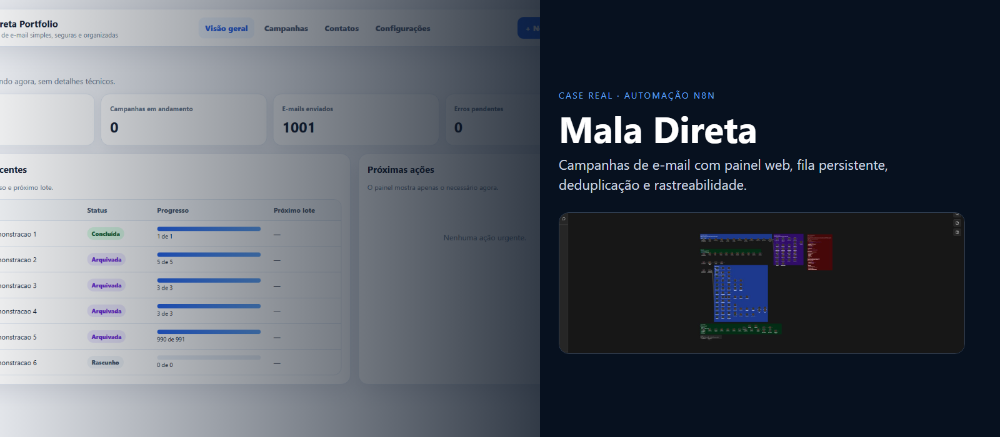
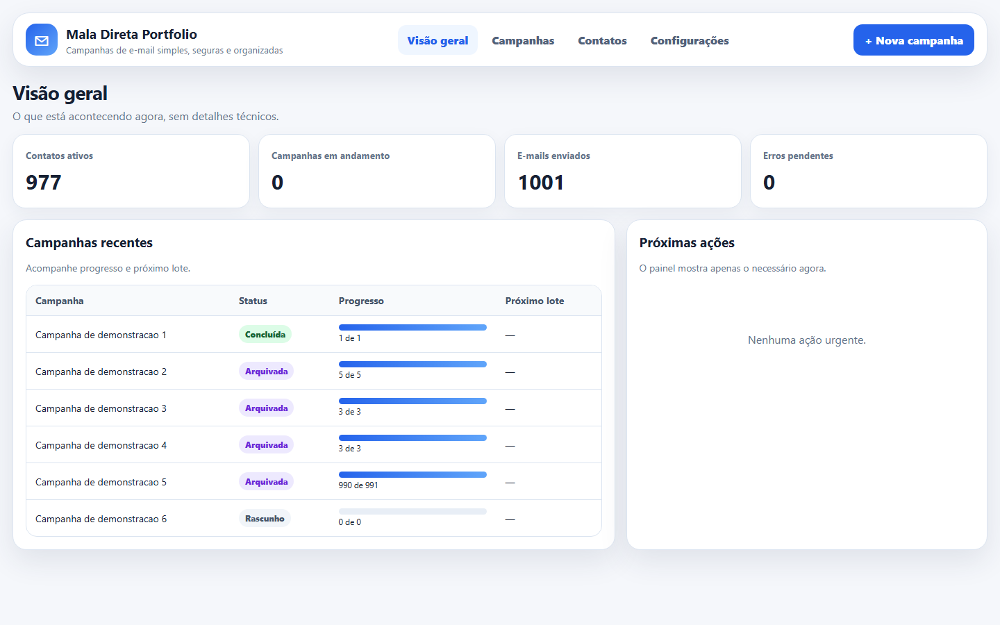
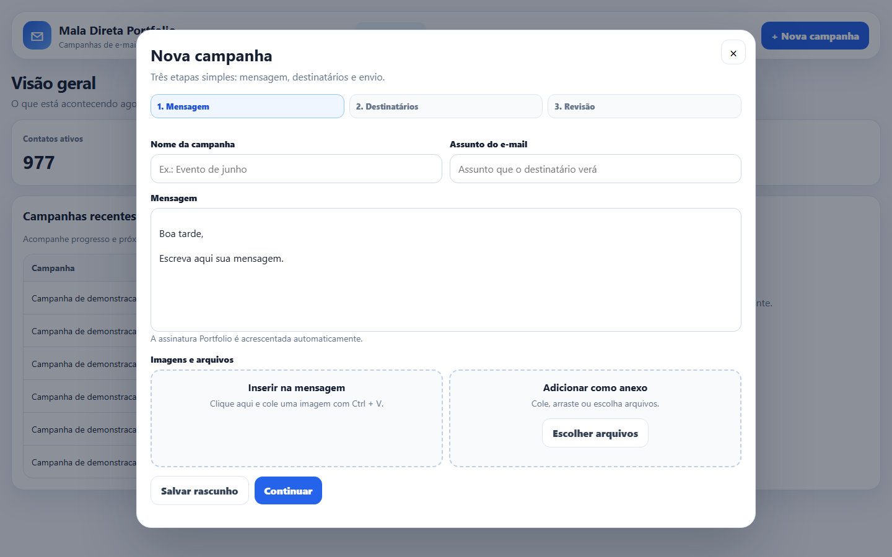
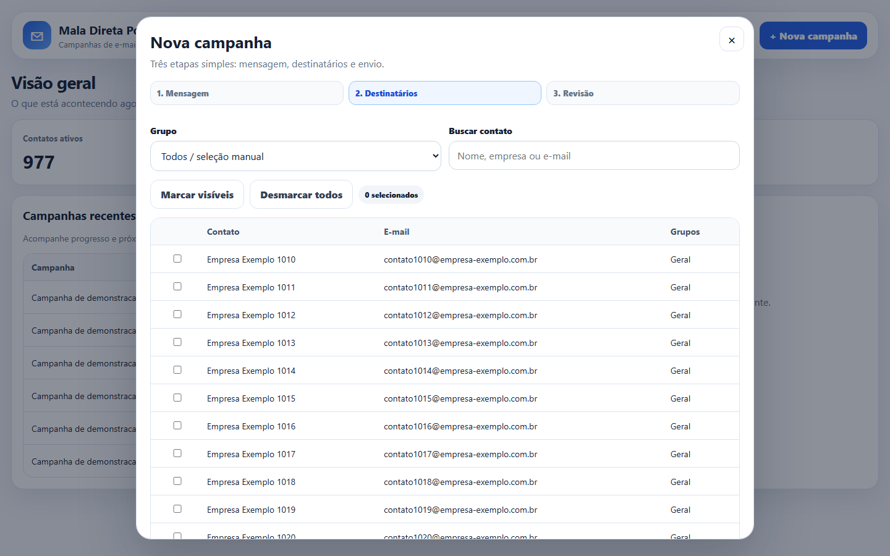
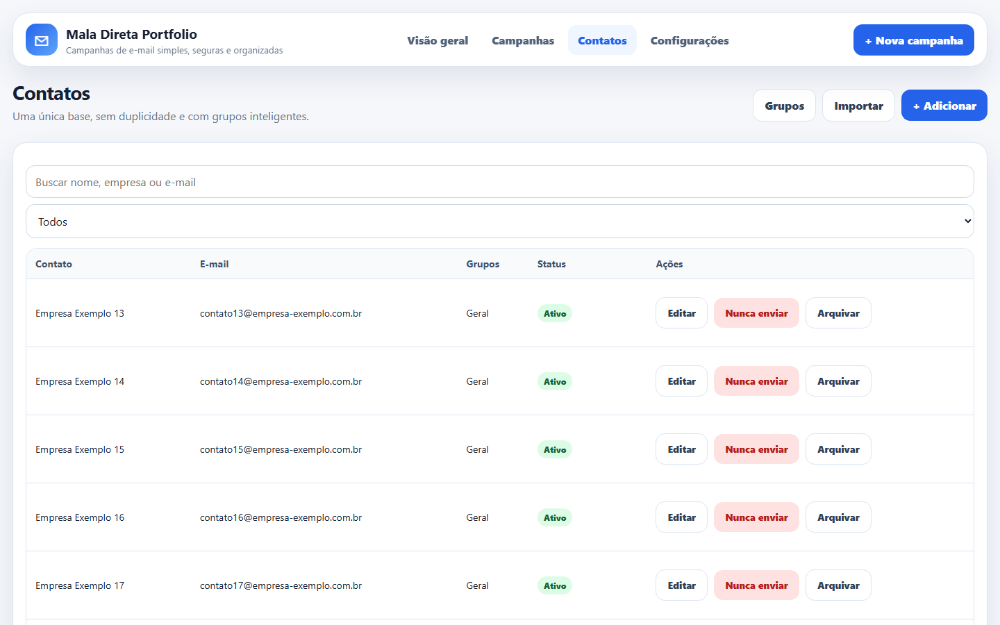
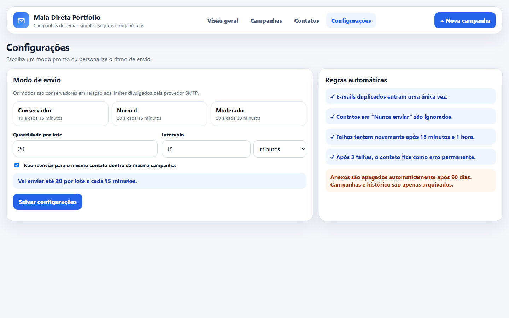
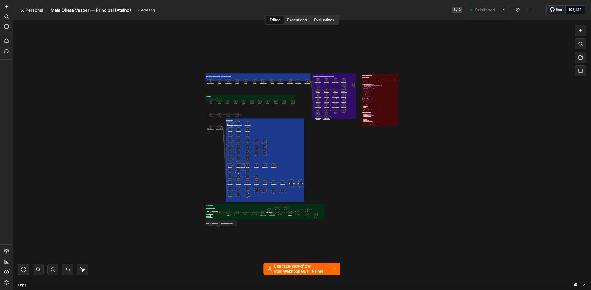
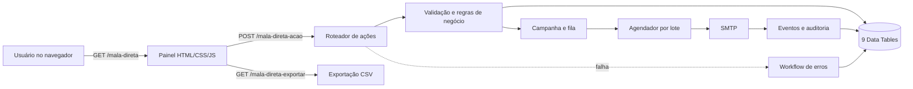

<p align="center">
  
</p>

<h1 align="center">Mala Direta</h1>
<p align="center">
  <strong>Um processo real de comunicação em lote transformado em produto interno: painel web, fila persistente, deduplicação, auditoria e operação em rede.</strong>
</p>

<p align="center">
  <a href="README.en.md">English</a> ·
  <a href="docs/CASE_STUDY.md">Case técnico</a> ·
  <a href="docs/ARCHITECTURE.md">Arquitetura</a> ·
  <a href="docs/TESTING.md">Qualidade</a>
</p>

<p align="center">
  
  
  
  
</p>

## O projeto em uma frase

Eu construí esta automação para tirar o envio de comunicados do improviso. Em vez de planilhas soltas, cópia manual de endereços e nenhuma rastreabilidade, a equipe passou a trabalhar em um painel simples, acessado pelo navegador, enquanto o n8n cuida da validação, fila, SMTP, histórico e recuperação de erros.

O repositório é uma versão pública e sanitizada do sistema que roda em ambiente real. As telas são da aplicação em funcionamento; nomes, e-mails, endereços internos e credenciais foram removidos ou substituídos por dados fictícios.

## O que foi entregue

- painel web responsivo servido por webhook, sem exigir acesso ao editor do n8n;
- cadastro, importação, busca, grupos e lista de bloqueio de contatos;
- editor de mensagem, assinatura, anexos e envio de teste;
- campanhas em rascunho, pausadas, arquivadas e em processamento;
- parcelamento por lote e agendamento em segundo plano;
- proteção contra duplicidade por destinatário e campanha;
- histórico de eventos, exportação CSV e workflow separado de erros;
- migração idempotente da base anterior para Data Tables;
- execução em Docker com PostgreSQL e backup diário validado.

## Evidência de escala

Snapshot de validação do ambiente real em **14/07/2026**:

| Indicador | Resultado |
|---|---:|
| Nós no workflow principal | 147 |
| Data Table nodes | 67 |
| Code nodes | 46 |
| Webhooks de produção | 3 |
| Data Tables de domínio | 9 |
| Contatos migrados | 997 |
| Contatos bloqueados por dado inválido | 20 |
| Eventos históricos preservados | 1.522 |
| Envios disparados durante a validação | 0 |

Os números demonstram o ambiente validado, mas nenhum registro de produção está incluído neste repositório.

## Produto em uso

| Visão geral | Mensagem e prévia |
|---|---|
|  |  |

| Seleção de destinatários | Contatos e grupos |
|---|---|
|  |  |

| Configuração de envio | Workflow real no n8n |
|---|---|
|  |  |

> As capturas do painel foram feitas na aplicação real com substituição dos dados visíveis por exemplos. A captura do canvas mostra o workflow publicado de produção, sem credenciais.

## Como funciona



O frontend está dentro do próprio workflow. O webhook GET monta o painel com os dados do domínio; o POST recebe ações com resposta rápida; dois gatilhos agendados processam a fila e a limpeza de anexos. A persistência usa Data Tables sobre PostgreSQL, evitando que atualização ou reinício do container apague a operação.

## Decisões que fizeram diferença

| Decisão | Motivo |
|---|---|
| Data Tables + PostgreSQL | consistência, consulta e persistência melhores que arquivos JSON concorrentes |
| campanha e destinatário separados | acompanhar progresso, erro e deduplicação por pessoa |
| lista de supressão | um e-mail inválido ou bloqueado não volta para a fila por acidente |
| fila agendada | controlar volume e respeitar limites do servidor SMTP |
| migração idempotente | poder repetir a carga sem multiplicar contatos ou eventos |
| workflow de erros | separar recuperação operacional do fluxo principal |
| credencial no n8n | nenhum segredo no JSON exportado ou no GitHub |

Os detalhes e trade-offs estão em [docs/ARCHITECTURE.md](docs/ARCHITECTURE.md) e [docs/CASE_STUDY.md](docs/CASE_STUDY.md).

## Estrutura do repositório

```text
.
├── .github/workflows/quality.yml
├── demo-data/                 # exemplos fictícios
├── docs/                      # arquitetura, case, deploy e testes
├── scripts/                   # sanitização, captura e validação
├── workflow/
│   ├── mala-direta-principal.portfolio.json
│   └── mala-direta-erros.portfolio.json
├── docker-compose.yml
└── README.md
```

## Validar o projeto

```powershell
npm ci
npm test
```

O teste confere a estrutura dos dois workflows, contagem mínima dos componentes críticos, rotas esperadas, estado inativo e ausência de credenciais. A segunda etapa procura IPs privados, caminhos locais, domínios corporativos e padrões de segredo.

## Rodar localmente

O `docker-compose.yml` é uma base reproduzível para n8n + PostgreSQL. A versão pública do workflow mantém a topologia real, mas usa placeholders para os IDs das Data Tables e não inclui credenciais SMTP. Isso é intencional.

1. copie `.env.example` para `.env` e gere valores fortes;
2. execute `docker compose up -d`;
3. importe os dois JSONs de `workflow/`;
4. crie as nove Data Tables descritas em [docs/DEPLOYMENT.md](docs/DEPLOYMENT.md) e associe cada placeholder;
5. cadastre o SMTP no cofre de credenciais do n8n;
6. publique primeiro o workflow de erros e depois o principal.

Não use o projeto para envio não solicitado. Consentimento, descadastro, SPF, DKIM, DMARC, limites do provedor e LGPD fazem parte da operação responsável.

## Autor

**Mayconxzdev** — automação, arquitetura, implementação full-stack, migração e operação.

- GitHub: [github.com/Mayconxzdev](https://github.com/Mayconxzdev)
- Contato: [mayconxz00dev@gmail.com](mailto:mayconxz00dev@gmail.com)
