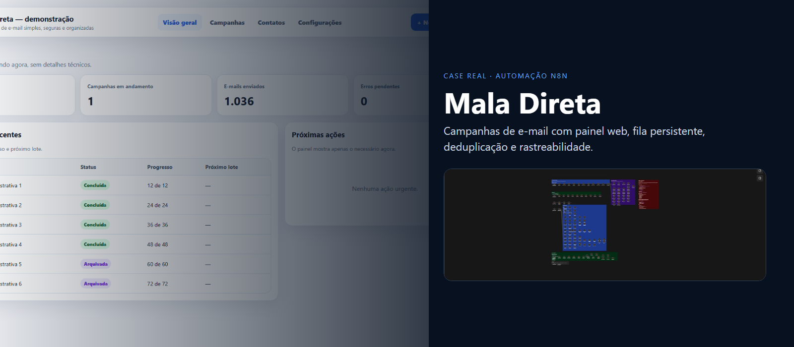
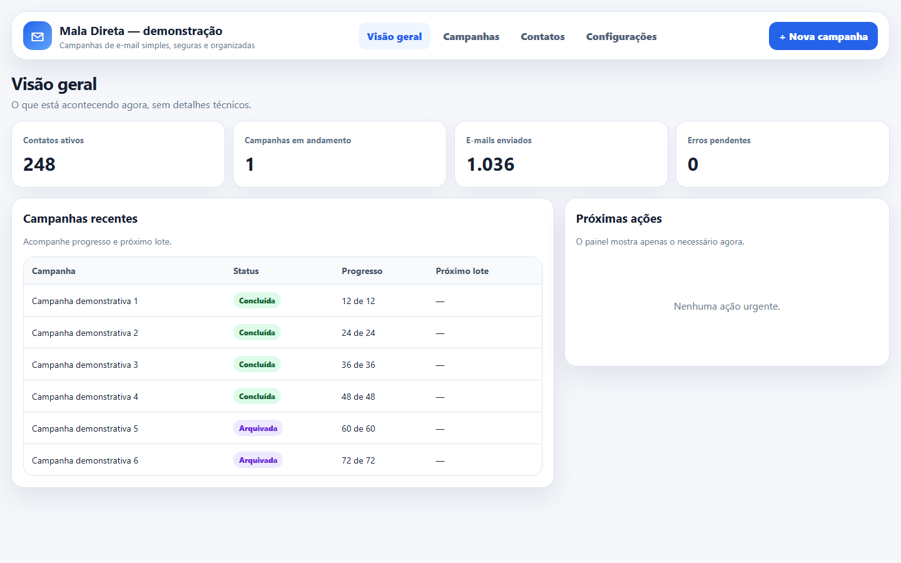
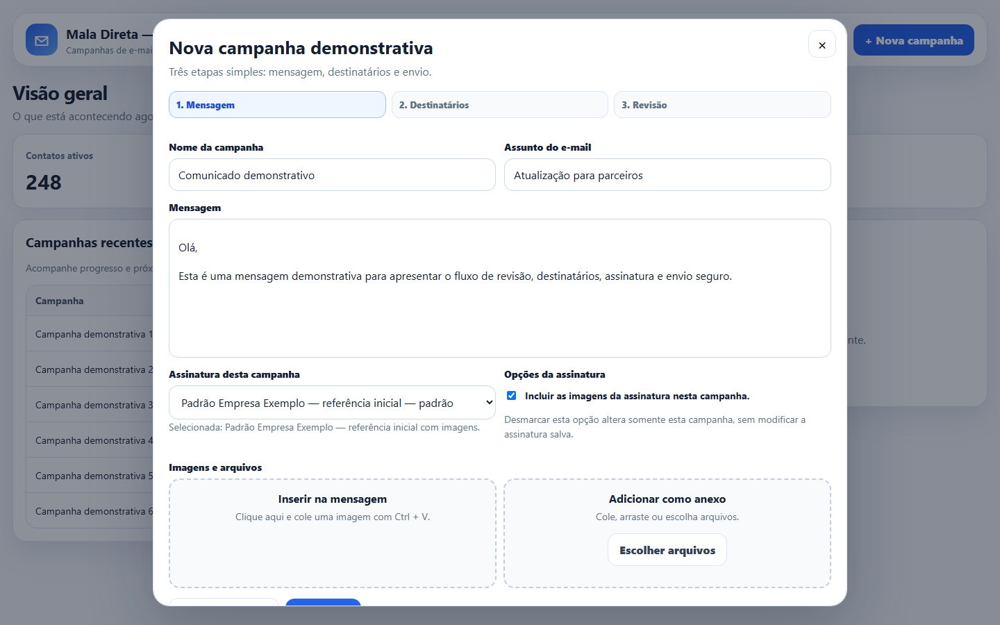
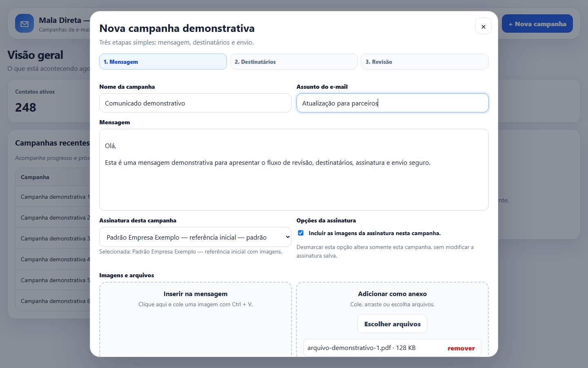
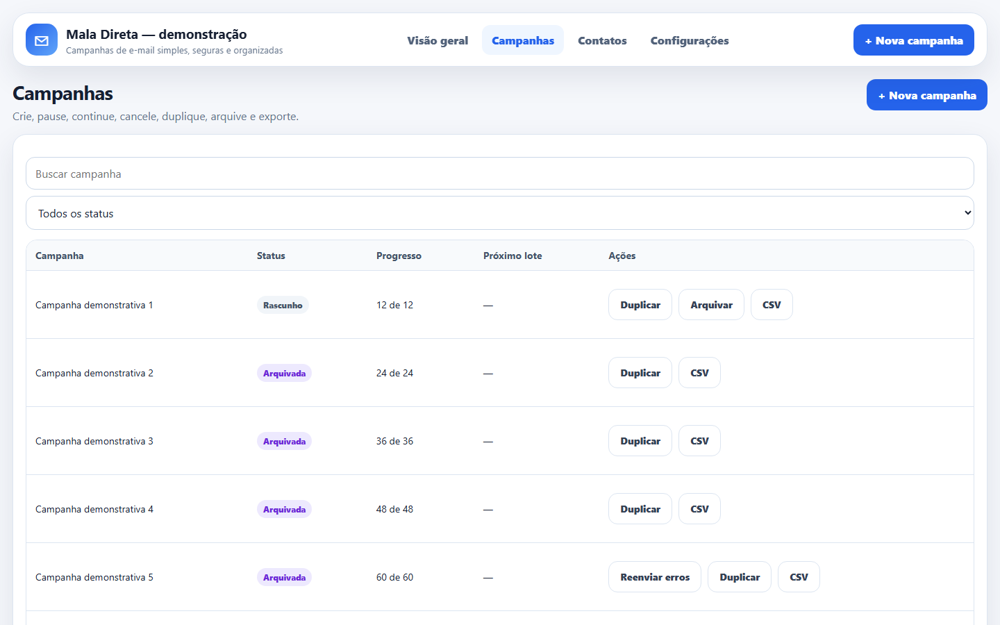
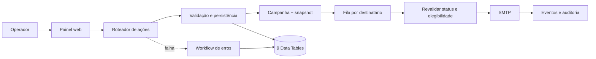

<p align="center">
  
</p>

<h1 align="center">Mala Direta</h1>
<p align="center"><strong>Automação de campanhas de e-mail com interface simples, fila por destinatário, cancelamento revalidado e auditoria.</strong></p>

<p align="center">
  <a href="README.en.md">English</a> ·
  <a href="docs/CASE_STUDY.md">Case técnico</a> ·
  <a href="docs/ARCHITECTURE.md">Arquitetura</a> ·
  <a href="docs/TESTING.md">Qualidade</a> ·
  <a href="docs/DEPLOYMENT.md">Setup público</a>
</p>

<p align="center">
  
  
  
  
</p>

## Leitura rápida para recrutadores

| Dimensão | Evidência atual |
|---|---|
| **Uso real** | Seis campanhas executadas sobre uma base atual de 1.020 contatos. |
| **Escala de campanha** | Uma campanha incluiu mais de 900 destinatários; retornos por endereços alterados ou inválidos foram identificados para revisão. |
| **Arquitetura pública** | Dois workflows; o principal possui 158 nós, 72 Data Table nodes, 49 Code nodes e nove Data Tables de domínio. |
| **Confiabilidade** | Fila por destinatário, deduplicação, supressão, retry, workflow de erros, histórico e eventos auditáveis. |
| **Controle operacional** | Cancelamento revalidado dentro do loop antes de cada destinatário; mensagens já aceitas pelo SMTP não podem ser recolhidas. |
| **Segurança pública** | Exports inativos, dados fictícios, ausência de credenciais e validação automática de privacidade. |

> A instância n8n interna que hospeda esta e outras automações ultrapassou **10 mil execuções de produção**. Esse volume pertence ao ambiente completo e não é atribuído exclusivamente à Mala Direta.

## Problema resolvido

O processo anterior dependia de planilhas, cópia manual de endereços, assinaturas espalhadas e pouca rastreabilidade sobre envio, falha ou cancelamento. Transformei esse fluxo em um produto interno acessado pelo navegador: a equipe cria a campanha, revisa destinatários, escolhe a assinatura, testa, agenda e acompanha o resultado sem abrir o editor do n8n.

O n8n executa regras de negócio, persistência, fila, SMTP, auditoria e recuperação de falhas.

> Esta publicação é um recorte demonstrativo da solução em operação. Nomes, domínios, e-mails, campanhas, credenciais e IDs internos foram removidos ou substituídos.

## Proteções operacionais

| Situação | Resposta da automação |
|---|---|
| Operador não conhece n8n | Painel web servido pelos próprios webhooks. |
| Campanha é cancelada durante a fila | Status e elegibilidade são revalidados antes de cada destinatário. |
| Provedor demora ou um lote falha | Estado individual, retry controlado e workflow separado de erro. |
| Assinatura muda | Biblioteca versionada e snapshot por campanha. |
| Contato não deve voltar à fila | Supressão e deduplicação por campanha + destinatário. |
| Fila altera indicadores | Agregação estável no painel, sem paginação concorrente sobre destinatários. |

## Evidência técnica do export público

| Indicador | Valor |
|---|---:|
| Workflows públicos | 2 |
| Nós no workflow principal | 158 |
| Data Table nodes | 72 |
| Code nodes | 49 |
| Webhooks públicos | 3 |
| Schedule Triggers | 2 |
| Data Tables de domínio | 9 |
| Segredos ou campanhas reais no repositório | 0 |

O validador [`scripts/validate-public-workflows.js`](scripts/validate-public-workflows.js) exige topologia mínima, valida rotas, compila os Code nodes e bloqueia referências internas ou credenciais.

## Interface e fluxo

| Visão geral | Mensagem e prévia |
|---|---|
|  |  |

| Destinatários | Operação de campanhas |
|---|---|
|  |  |


```mermaid
flowchart LR
    U[Operador] --> P[Painel web]
    P --> R[Roteador de ações]
    R --> V[Validação e persistência]
    V --> C[Campanha + snapshot]
    C --> Q[Fila por destinatário]
    Q --> G[Revalidar status e elegibilidade]
    G --> S[SMTP]
    S --> A[Eventos e auditoria]
    V --> D[(9 Data Tables)]
    R -. falha .-> E[Workflow de erros]
    E --> D
```

## Decisões de engenharia

- campanha e destinatário separados para progresso, retry, bloqueio e histórico por pessoa;
- Data Tables sobre PostgreSQL para persistência e consulta sem arquivos concorrentes;
- cancelamento validado dentro do loop, não somente no início;
- workflow de erros isolado do fluxo de negócio;
- credenciais mantidas no cofre do n8n;
- frontend no workflow para reduzir a superfície de deploy da operação local.

## Validar localmente

```powershell
npm ci
npm test
```

Os dois workflows públicos são inativos por segurança. Para uma instalação de estudo, crie as nove Data Tables e vincule uma credencial SMTP própria no cofre do n8n, seguindo [`docs/DEPLOYMENT.md`](docs/DEPLOYMENT.md).

## Limites

- não representa SLA ou auditoria formal de entrega;
- bounce, reputação, descadastro, SPF, DKIM e DMARC precisam ser monitorados conforme o volume;
- múltiplos workers exigiriam política adicional de concorrência e rate limit;
- o painel deve ficar atrás de autenticação e TLS fora de uma rede confiável;
- não deve ser usado para envio não solicitado.

## Autor

**Maycon Ferreira** — levantamento, arquitetura, workflows, integrações, UX operacional, implantação, treinamento, validação e sustentação.

- GitHub: [github.com/Mayconxzdev](https://github.com/Mayconxzdev)
- Contato: [mayconxz00dev@gmail.com](mailto:mayconxz00dev@gmail.com)
