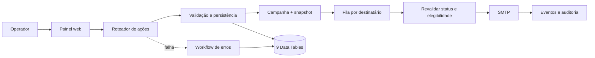

<p align="center">
  
</p>

<h1 align="center">Mala Direta</h1>
<p align="center"><strong>Automação de campanhas de e-mail com interface simples, fila por destinatário, cancelamento revalidado e auditoria.</strong></p>

<p align="center">
  <a href="README.en.md">English</a> ·
  <a href="docs/CASE_STUDY.md">Case técnico</a> ·
  <a href="docs/ARCHITECTURE.md">Arquitetura</a> ·
  <a href="docs/TESTING.md">Qualidade</a> ·
  <a href="docs/DEPLOYMENT.md">Setup público</a>
</p>

<p align="center">
  
  
  
  
</p>

## Visão geral

Desenvolvi a Mala Direta para substituir um processo baseado em planilhas, cópia manual de endereços, arquivos de assinatura espalhados e pouca visibilidade sobre envios, falhas e cancelamentos. A equipe passou a criar, revisar, testar, agendar e acompanhar campanhas pelo navegador, sem precisar abrir o editor do n8n.

| Aspecto | Situação atual |
|---|---|
| **Uso interno** | Seis campanhas executadas sobre uma base atual de 1.020 contatos. |
| **Escala de campanha** | Uma campanha incluiu mais de 900 destinatários; endereços alterados ou inválidos ficaram identificados para revisão. |
| **Arquitetura pública** | Dois workflows; o principal possui 158 nós, 72 Data Table nodes, 49 Code nodes e nove Data Tables de domínio. |
| **Confiabilidade** | Fila por destinatário, deduplicação, supressão, retry, workflow de erros, histórico e eventos auditáveis. |
| **Controle operacional** | O cancelamento é revalidado dentro do loop antes de cada destinatário. Mensagens já aceitas pelo SMTP não podem ser recolhidas. |
| **Privacidade** | Exports inativos, dados fictícios, ausência de credenciais e validação automática da versão pública. |

> A instância n8n que hospeda esta e outras automações ultrapassou **10 mil execuções de produção**. Esse volume pertence ao ambiente completo e não somente à Mala Direta.

## Como funciona

O n8n concentra regras de negócio, persistência, fila, SMTP, auditoria e recuperação de falhas. A interface web serve como camada operacional para pessoas que não precisam conhecer os workflows.


```mermaid
flowchart LR
    U[Operador] --> P[Painel web]
    P --> R[Roteador de ações]
    R --> V[Validação e persistência]
    V --> C[Campanha + snapshot]
    C --> Q[Fila por destinatário]
    Q --> G[Revalidar status e elegibilidade]
    G --> S[SMTP]
    S --> A[Eventos e auditoria]
    V --> D[(9 Data Tables)]
    R -. falha .-> E[Workflow de erros]
    E --> D
```

## Proteções operacionais

| Situação | Resposta da automação |
|---|---|
| A pessoa não conhece n8n | O painel web é servido pelos próprios webhooks. |
| A campanha é cancelada durante a fila | Status e elegibilidade são verificados novamente antes de cada destinatário. |
| O provedor demora ou um lote falha | O fluxo mantém estado individual, retry controlado e um workflow separado de erro. |
| A assinatura muda | A biblioteca é versionada e cada campanha mantém seu snapshot. |
| Um contato não deve voltar à fila | Supressão e deduplicação por campanha + destinatário. |
| A fila altera indicadores | O painel usa agregações estáveis, sem paginação concorrente sobre destinatários. |

## Estrutura técnica publicada

| Indicador | Valor |
|---|---:|
| Workflows públicos | 2 |
| Nós no workflow principal | 158 |
| Data Table nodes | 72 |
| Code nodes | 49 |
| Webhooks públicos | 3 |
| Schedule Triggers | 2 |
| Data Tables de domínio | 9 |
| Segredos ou campanhas reais no repositório | 0 |

O script [`scripts/validate-public-workflows.js`](scripts/validate-public-workflows.js) verifica a topologia mínima, as rotas, a compilação dos Code nodes e a ausência de referências internas ou credenciais.

## Interface

| Visão geral | Mensagem e prévia |
|---|---|
|  |  |

| Destinatários | Operação de campanhas |
|---|---|
|  |  |

## Decisões técnicas

- separei campanha e destinatário para acompanhar progresso, retry, bloqueio e histórico individual;
- usei Data Tables sobre PostgreSQL para evitar arquivos concorrentes;
- coloquei a validação de cancelamento dentro do loop, e não somente no início da campanha;
- isolei falhas técnicas do fluxo principal em um workflow de erros;
- mantive credenciais no cofre do n8n;
- deixei o frontend no workflow para reduzir a superfície de deploy da operação local.

## Executar e validar

```powershell
npm ci
npm test
```

Os dois workflows públicos ficam inativos por segurança. Uma instalação de estudo exige as nove Data Tables e uma credencial SMTP própria no cofre do n8n. O passo a passo está em [`docs/DEPLOYMENT.md`](docs/DEPLOYMENT.md).

## Estado e limites

- a versão pública não representa SLA nem auditoria formal de entrega;
- bounce, reputação, descadastro, SPF, DKIM e DMARC precisam ser acompanhados conforme o volume;
- múltiplos workers exigiriam controles adicionais de concorrência e rate limit;
- fora de uma rede confiável, o painel precisa de autenticação e TLS;
- a automação não deve ser usada para envio não solicitado.

> Esta publicação é um recorte demonstrativo da solução interna. Nomes, domínios, e-mails, campanhas, credenciais e IDs foram removidos ou substituídos.

## Autor

**Maycon Ferreira** — levantamento, arquitetura, workflows, integrações, experiência operacional, implantação, treinamento, validação e sustentação.

- GitHub: [github.com/Mayconxzdev](https://github.com/Mayconxzdev)
- Contato: [mayconxz00dev@gmail.com](mailto:mayconxz00dev@gmail.com)
