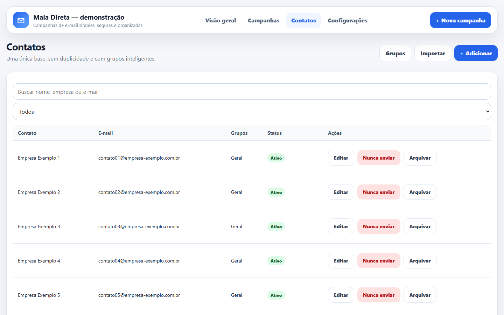
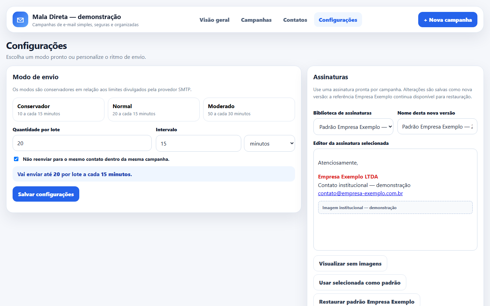
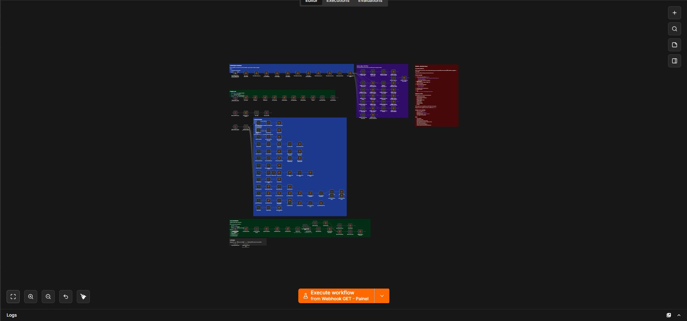
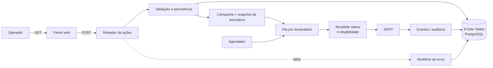

<p align="center">
  
</p>

<h1 align="center">Mala Direta</h1>
<p align="center">
  <strong>Automação de e-mail operacional: uma interface simples para a equipe e uma operação rastreável, segura e previsível no n8n.</strong>
</p>

<p align="center">
  <a href="README.en.md">English</a> ·
  <a href="docs/CASE_STUDY.md">Case técnico</a> ·
  <a href="docs/ARCHITECTURE.md">Arquitetura</a> ·
  <a href="docs/TESTING.md">Qualidade</a> ·
  <a href="docs/DEPLOYMENT.md">Setup público</a>
</p>

<p align="center">
  
  
  
  
</p>

## O problema que resolvi

Envio em lote não é apenas “disparar e-mail”. O processo anterior dependia de planilhas, cópia manual de endereços, arquivos de assinatura espalhados e pouca certeza sobre quem recebeu, o que falhou ou se uma campanha cancelada realmente parou.

Transformei esse fluxo em um produto interno acessado pelo navegador. Quem opera não precisa abrir o editor do n8n: cria a campanha, revisa destinatários, escolhe a assinatura, testa, agenda e acompanha o resultado. O n8n fica responsável pela regra de negócio, persistência, fila, SMTP, auditoria e recuperação de falhas.

> Este é um recorte público e demonstrativo de uma automação em operação. Dados, nomes, domínio, e-mails, identidade visual, credenciais e IDs internos foram substituídos. Os exports estão inativos por design e não podem disparar nada após a importação.

## O que torna a solução operacionalmente segura

| Situação de operação | Como a automação responde |
|---|---|
| A equipe precisa criar uma campanha sem conhecer n8n | Painel web servido pelos próprios webhooks do workflow |
| Uma mensagem foi cancelada enquanto havia fila | O loop revalida status e elegibilidade antes de cada destinatário; e-mails já aceitos pelo SMTP não podem ser recolhidos |
| Um lote falha ou o provedor demora | Estado por destinatário, evento auditável e workflow separado para erro técnico |
| Uma assinatura muda entre comunicações | Biblioteca versionada, escolha por campanha, snapshot no momento do envio e restauração do padrão |
| A imagem da assinatura não deve aparecer em uma campanha | Opção explícita por campanha; a biblioteca mantém a versão completa para reutilização posterior |
| O painel está lendo dados enquanto a fila atualiza | Agregação estável de indicadores, sem paginação concorrente sobre a tabela de destinatários |
| Um contato não pode voltar à fila | Lista de supressão e deduplicação por campanha + destinatário |

## Evidência técnica do export público atual

| Indicador | Evidência |
|---|---:|
| Nós no workflow principal | 158 |
| Data Table nodes | 72 |
| Code nodes | 49 |
| Webhooks públicos | 3 |
| Schedule Triggers | 2 |
| Loop seguro por lote | 1 `Split In Batches` |
| Data Tables de domínio | 9 |
| Credenciais, dados e campanhas reais no repositório | 0 |

O [validador do repositório](scripts/validate-public-workflows.js) exige a topologia mínima, checa as rotas, compila cada Code node e bloqueia referências internas ou credenciais antes de uma alteração ser aceita.

### Estado operacional

A automação está em uso no ambiente interno e já ultrapassou **10 mil execuções de produção** no n8n.

Esse número representa um snapshot operacional do painel e não deve ser interpretado como SLA, auditoria formal ou garantia permanente de volume e disponibilidade.

## Interface em operação — dados demonstrativos

| Visão geral | Mensagem e prévia |
|---|---|
|  |  |

| Seleção de destinatários | Contatos e grupos |
|---|---|
|  |  |

| Biblioteca de assinatura | Canvas real do n8n |
|---|---|
|  |  |

| Operação de campanhas | |
|---|---|
|  | |

As telas do painel vêm da aplicação em execução com o conteúdo visível substituído por exemplos. O canvas é uma captura do editor n8n: não é diagrama desenhado, não contém credenciais e é enquadrado para não expor navegação ou dados operacionais.

## Fluxo de ponta a ponta


```mermaid
flowchart LR
    U["Operador"] -->|GET| P["Painel web"]
    P -->|POST| R["Roteador de ações"]
    R --> V["Validação e persistência"]
    V --> C["Campanha + snapshot da assinatura"]
    C --> Q["Fila por destinatário"]
    T["Agendador"] --> Q
    Q --> G["Revalidar status\ne elegibilidade"]
    G --> S["SMTP"]
    S --> A["Eventos / auditoria"]
    V --> D[("9 Data Tables\nPostgreSQL")]
    A --> D
    R -. falha .-> E["Workflow de erros"]
    E --> D
```

O frontend vive dentro do workflow, deliberadamente. Isso reduziu a superfície de deploy para a operação local e manteve a experiência, o estado e a automação no mesmo produto. Os trade-offs estão documentados em [Arquitetura](docs/ARCHITECTURE.md).

## Decisões de engenharia

| Decisão | Por que importa |
|---|---|
| Data Tables sobre PostgreSQL | persistência e consulta sem depender de arquivos concorrentes |
| campanha e destinatário separados | progresso, retry, bloqueio e histórico por pessoa |
| biblioteca de assinatura versionada | evita editar HTML a cada envio e preserva o contexto de cada campanha |
| cancelamento revalidado no loop | reduz o risco de continuar uma fila após uma decisão operacional |
| agregados estáveis no dashboard | evita erro de paginação quando a fila altera o total durante a leitura |
| workflow dedicado de erros | isola falhas técnicas do fluxo de negócio |
| credencial no cofre do n8n | nenhum segredo é exportado, exibido ou versionado |

## Estrutura do repositório

```text
.
├── .github/workflows/quality.yml  # validação no GitHub Actions
├── demo-data/                     # exemplos fictícios
├── docs/                          # case, arquitetura, setup e testes
├── docs/assets/                   # capturas sanitizadas e canvas real
├── scripts/                       # sanitização, captura e validação
├── workflow/                      # exports n8n públicos e inativos
├── docker-compose.yml             # runtime local de referência
└── README.md
```

## Validar localmente

```powershell
npm ci
npm test
```

O teste valida os dois workflows e faz varredura de privacidade. Para montar uma instalação de estudo, siga o [setup público](docs/DEPLOYMENT.md): é necessário criar as nove Data Tables e vincular uma credencial SMTP própria no cofre do n8n. Não há segredos embutidos neste repositório.

## Limites e próximos passos responsáveis

- o painel deve ficar atrás de autenticação e TLS se sair de uma rede confiável;
- o primeiro disparo deve usar destinatário autorizado e limite SMTP conservador;
- bounce, reputação e descadastro devem ser monitorados em volume maior;
- múltiplos workers exigem uma política adicional de concorrência e rate limit.

Não use esta automação para envio não solicitado. Consentimento, descadastro, SPF, DKIM, DMARC, limites do provedor e LGPD fazem parte do produto, não são detalhes posteriores.

## Autor

**Maycon Ferreira** — arquitetura de automação, integrações, UX operacional, migração, validação e sustentação.

- GitHub: [github.com/Mayconxzdev](https://github.com/Mayconxzdev)
- Contato: [mayconxz00dev@gmail.com](mailto:mayconxz00dev@gmail.com)
