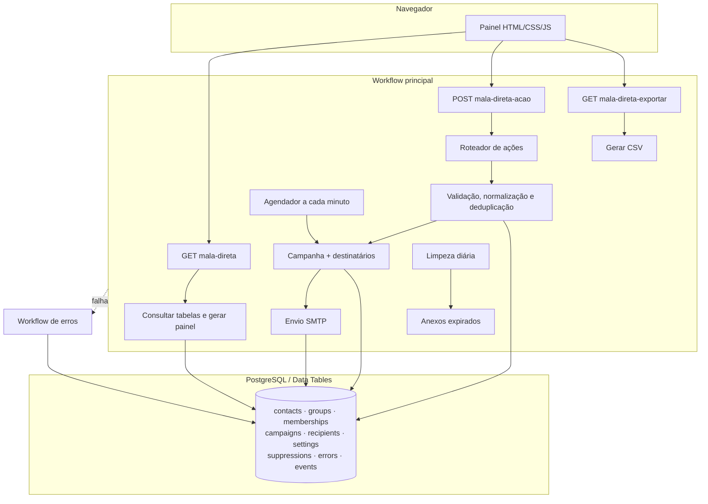

# Arquitetura

## Visão geral

O sistema usa o n8n como runtime, backend e camada de apresentação. O workflow principal tem 147 nós e reúne cinco áreas: migração, painel, ações, processamento agendado e manutenção. Um segundo workflow recebe falhas pelo Error Trigger.

## Entradas públicas

| Método | Rota | Responsabilidade |
|---|---|---|
| GET | `/webhook/mala-direta` | consultar o estado e renderizar o painel |
| POST | `/webhook/mala-direta-acao` | validar e executar as ações do usuário |
| GET | `/webhook/mala-direta-exportar` | gerar exportação CSV sanitizada pela regra de negócio |

Os três Webhook nodes têm `webhookId` explícito. Isso mantém as rotas curtas na versão atual do n8n e evita o caminho derivado de ID/nome do nó.

## Modelo de dados

| Tabela | Responsabilidade |
|---|---|
| `mdv_contacts` | contato normalizado, estado e origem |
| `mdv_groups` | grupos lógicos |
| `mdv_memberships` | relação grupo-contato |
| `mdv_campaigns` | mensagem, configuração e ciclo de vida |
| `mdv_recipients` | progresso individual de cada destinatário |
| `mdv_settings` | configurações operacionais e assinatura |
| `mdv_suppressions` | endereços que nunca devem ser enviados |
| `mdv_errors` | falhas técnicas e contexto de execução |
| `mdv_events` | trilha de auditoria e histórico migrado |

Campanha e destinatário são entidades diferentes. Isso permite pausar uma campanha, retomar apenas pendências, registrar erro por endereço e impedir reenvio sem depender de um arquivo único.

## Processamento da fila

1. O painel cria ou atualiza uma campanha em rascunho.
2. Ao iniciar, os destinatários são normalizados e gravados com chave composta de campanha + contato.
3. A lista de supressão e os eventos anteriores eliminam endereços inelegíveis.
4. O agendador seleciona apenas o lote devido.
5. Os dois ramos SMTP tratam mensagens com e sem anexo.
6. Cada resultado atualiza o destinatário e cria um evento auditável.
7. Quando não há pendências, a campanha é concluída; erros continuam visíveis para análise.

## Migração

O ramo manual de preparação cria/reutiliza as tabelas e importa planilha, contatos extras, grupos, configuração, assinatura, fila e eventos legados. As gravações usam chaves estáveis e upsert, portanto o processo pode ser repetido sem multiplicar registros.

## Limites conhecidos

- a versão pública exige rebind dos placeholders de Data Table após a importação;
- o painel deve ficar atrás de autenticação/reverse proxy se sair de uma rede confiável;
- anexos grandes continuam sujeitos ao limite de payload do n8n;
- alto volume ou múltiplos workers exigem política explícita de concorrência e limite do SMTP.
