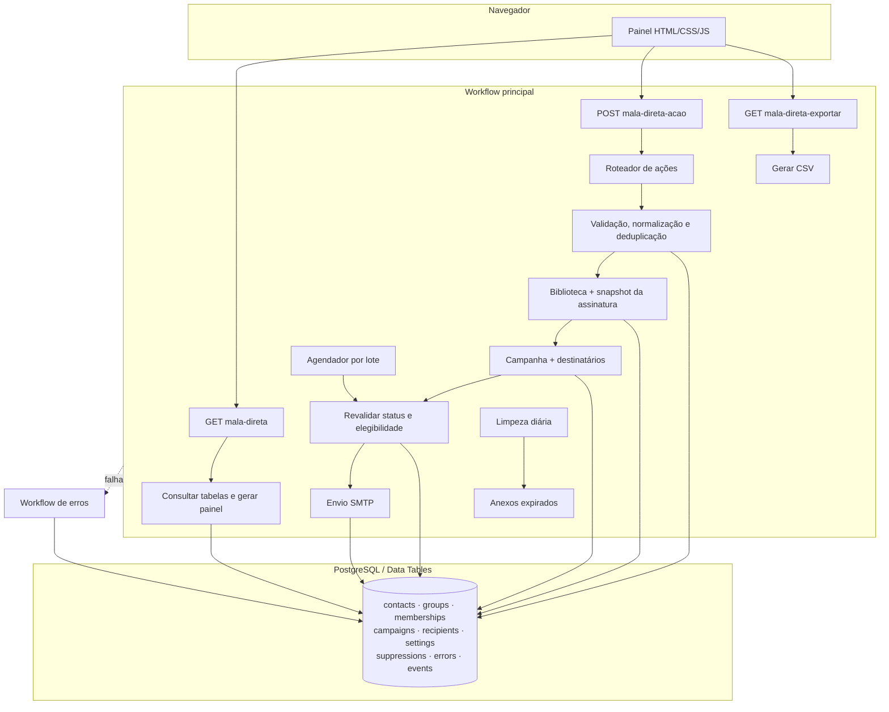

# Arquitetura

## Visão geral

O sistema usa o n8n como runtime, backend e camada de apresentação de uma operação interna de e-mail. O workflow principal público tem **158 nós**: 72 Data Table nodes, 49 Code nodes, três webhooks, dois gatilhos agendados e um `Split In Batches` que controla o loop de entrega. Um segundo workflow recebe falhas pelo Error Trigger.

```mermaid
flowchart TB
  subgraph Browser["Navegador"]
    UI["Painel HTML/CSS/JS"]
  end

  subgraph Main["Workflow principal"]
    GET["GET mala-direta"] --> BUILD["Consultar tabelas e gerar painel"]
    POST["POST mala-direta-acao"] --> ROUTER["Roteador de ações"]
    EXPORT["GET mala-direta-exportar"] --> CSV["Gerar CSV"]
    ROUTER --> RULES["Validação, normalização e deduplicação"]
    RULES --> SIGNATURE["Biblioteca + snapshot da assinatura"]
    SIGNATURE --> CAMPAIGN["Campanha + destinatários"]
    TIMER["Agendador por lote"] --> PRECHECK["Revalidar status e elegibilidade"]
    CAMPAIGN --> PRECHECK
    PRECHECK --> SMTP["Envio SMTP"]
    CLEANUP["Limpeza diária"] --> ATTACHMENTS["Anexos expirados"]
  end

  subgraph Storage["PostgreSQL / Data Tables"]
    TABLES[("contacts · groups · memberships\ncampaigns · recipients · settings\nsuppressions · errors · events")]
  end

  UI --> GET
  UI --> POST
  UI --> EXPORT
  BUILD --> TABLES
  RULES --> TABLES
  SIGNATURE --> TABLES
  CAMPAIGN --> TABLES
  PRECHECK --> TABLES
  SMTP --> TABLES
  Main -. falha .-> ERR["Workflow de erros"]
  ERR --> TABLES
```

## Entradas públicas

| Método | Rota | Responsabilidade |
|---|---|---|
| GET | `/webhook/mala-direta` | consultar o estado e renderizar o painel |
| POST | `/webhook/mala-direta-acao` | validar e executar ações do operador |
| GET | `/webhook/mala-direta-exportar` | gerar CSV conforme a regra de negócio |

Os três Webhook nodes têm `webhookId` explícito. Isso mantém rotas estáveis entre publicações e evita depender do nome visual do node.

## Modelo de dados

| Tabela | Responsabilidade |
|---|---|
| `mdv_contacts` | contato normalizado, estado e origem |
| `mdv_groups` | grupos lógicos |
| `mdv_memberships` | relação grupo-contato |
| `mdv_campaigns` | mensagem, agendamento, assinatura escolhida e ciclo de vida |
| `mdv_recipients` | progresso individual de cada destinatário |
| `mdv_settings` | regras operacionais, assinatura padrão e biblioteca versionada |
| `mdv_suppressions` | endereços que nunca devem receber a campanha |
| `mdv_errors` | falhas técnicas e contexto de execução |
| `mdv_events` | trilha de auditoria e histórico |

Campanha e destinatário são entidades diferentes. Isso permite acompanhar progresso por pessoa, tratar erro sem perder a campanha, pausar a fila e impedir reenvio acidental.

## Assinaturas: biblioteca, escolha e snapshot

O editor não trata assinatura como texto descartável. Cada alteração salva uma versão na configuração do domínio; uma versão padrão pode ser trocada ou restaurada com uma ação explícita. Na criação da campanha, o operador escolhe uma assinatura da biblioteca — inclusive a opção de não usar assinatura — e decide se imagens fazem parte daquele envio.

Ao salvar ou iniciar a campanha, a escolha é congelada no registro da campanha. Portanto, alterar a assinatura padrão depois não reescreve campanhas já criadas. Isso dá contexto ao histórico sem tornar a operação diária dependente do editor do n8n.

## Processamento da fila

1. O painel cria ou atualiza uma campanha em rascunho.
2. A campanha seleciona destinatários elegíveis e grava uma chave estável de campanha + contato.
3. Lista de supressão, validação e histórico removem endereços inelegíveis.
4. O agendador seleciona somente o lote devido.
5. Antes de cada envio, o loop verifica novamente o estado atual da campanha e do destinatário.
6. Os ramos SMTP tratam mensagens com e sem anexo.
7. Cada resultado atualiza o destinatário e cria um evento auditável.
8. Sem pendências, a campanha é concluída; falhas continuam consultáveis.

O passo 5 é importante: um cancelamento ou pausa que acontece enquanto há itens na fila impede os próximos envios que ainda não chegaram ao SMTP. Nenhuma automação pode desfazer uma mensagem que já foi aceita pelo servidor SMTP.

## Consistência do painel

O dashboard usa agregações estáveis para indicadores e não pagina a tabela de destinatários enquanto o próprio processamento pode alterar a quantidade de registros. Isso elimina o erro clássico de “result count changed during pagination” do painel sob concorrência de leitura e escrita.

## Migração e reexecução

O ramo manual de preparação cria/reutiliza as tabelas e importa contatos, grupos, configurações, assinatura, fila e eventos legados. As gravações usam chaves estáveis e upsert, então a carga pode ser repetida sem multiplicar registros.

## Segurança e limites

- o export público exige rebind dos placeholders de Data Table após importação;
- nenhuma credencial n8n ou configuração SMTP sai no JSON público;
- o painel deve ficar atrás de autenticação e TLS fora de uma rede confiável;
- anexos grandes continuam sujeitos ao limite de payload do n8n;
- alto volume ou múltiplos workers exigem política explícita de concorrência, retry e rate limit.
